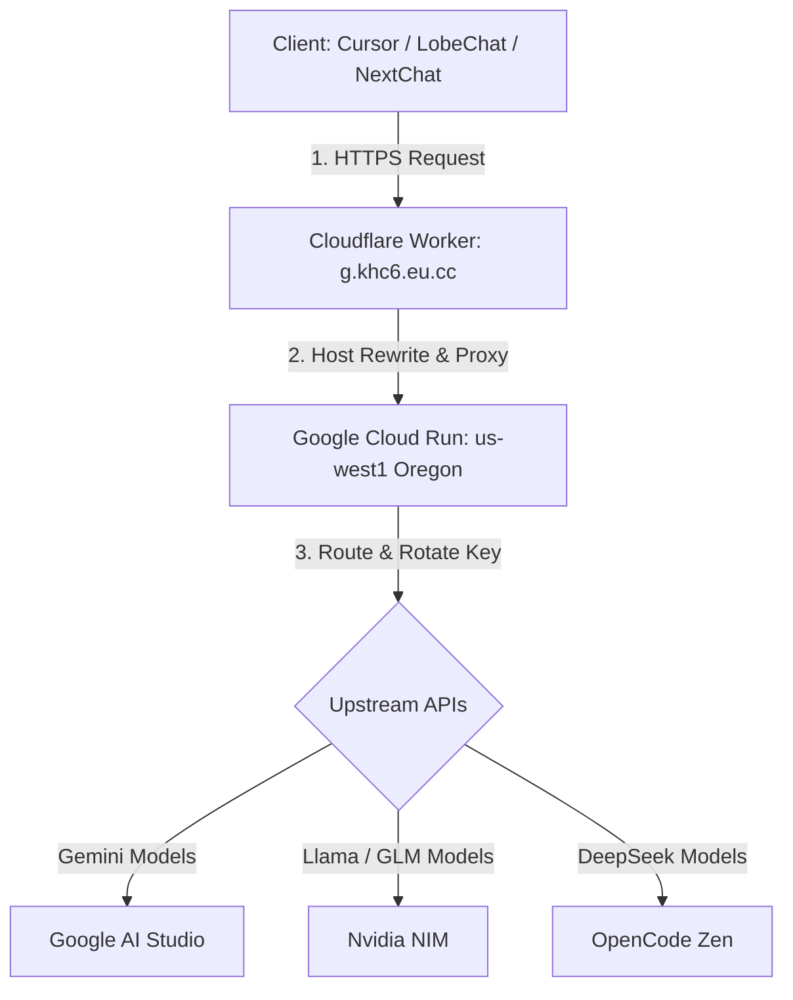

# FreeLLMAPI - High Performance Multi-Key LLM Gateway

A super lightweight, zero-dependency, and extremely fast Node.js API Gateway designed to run on **Google Cloud Run** and route through **Cloudflare Workers**. It aggregates and proxies free-tier API endpoints from major LLM providers with automatic key rotation and intelligent failover retry mechanisms.

---

## 🏗️ System Architecture

The gateway is architected for maximum speed, bypass of geo-blocking (GFW), and pure egress IPs:



### ⚡ Why this combination?
* **Zero Cold-Starts**: Runs on Cloud Run First Generation (`gen1`) with scaling down to 0 when idle to avoid any billing, while keeping the cold-starts under **1.2 seconds**.
* **Cloudflare Handshake Acceleration**: Cloudflare terminates the SSL/TLS connection near the client (~20ms), then uses its pre-established warm TCP backhaul directly to Google Cloud, resulting in **300ms faster** responses than direct access.
* **Inner-Backbone Latency**: The connection between Cloud Run and Google AI Studio travels inside Google's private global fiber network, minimizing transit delay to virtually **0ms**.

---

## ⚙️ Environment Variables Configuration

Configure these environment variables in your Cloud Run Service settings (under the Variables & Secrets tab):

| Variable Name | Description | Example / Format |
| :--- | :--- | :--- |
| `ACCESS_TOKEN` | The security password required by your API clients. | `your_secret_password` |
| `GOOGLE_KEYS` | Comma-separated list of Google Gemini API keys. | `key1,key2,key3` |
| `NVIDIA_KEYS` | Comma-separated list of Nvidia NIM API keys. | `key1,key2,key3` |
| `OPENCODE_KEYS` | Comma-separated list of OpenCode Zen API keys. | `key1,key2` |
| `EXPOSED_MODELS` | Comma-separated list of models to expose via the gateway. | `gemini-2.5-flash,gemini-3.1-flash-lite,z-ai/glm-5.2,minimaxai/minimax-m3,openai/gpt-oss-120b,stepfun-ai/step-3.7-flash,deepseek-v4-flash-free` |

---

## 🔀 Routing & Error Recovery Rules

The gateway implements a strict routing matching pipeline with specific handling rules for high reliability:

1. **Routing Mechanics**:
   * **Google Gemini**: Explicitly matches models starting with `gemini-` and translates payloads to the native Gemini API structure.
   * **OpenCode Zen**: Matches models ending with `-free` (e.g., `deepseek-v4-flash-free`, `hy3-free`) and routes to the OpenCode Zen API.
   * **Nvidia NIM**: Serves as the catch-all router for other models if Nvidia keys are set.
   * **No Quiet Fallback**: If a model request doesn't match any active configurations, the gateway returns a clear `400 Bad Request` instead of routing it silently to Google.

2. **Smart Retries & Key Rotation**:
   * The gateway rotates API keys dynamically upon encountering retryable failures.
   * **Retryable Errors**: Only `5xx` server errors, network connection drops, timeouts, and `408` / `429` (rate limits) will trigger a retry and rotate keys.
   * **Non-Retryable Errors**: Bad requests (`400`), invalid tokens (`401`), forbidden access (`403`), and unknown models (`404`) return instantly to avoid wasteful key consumption and latency.

---

## 🚀 Deployment Instructions

### 1. Prerequisite: Install Google Cloud SDK
Ensure you have the `gcloud` CLI installed on your machine and you are authenticated to your target GCP Project:
```bash
gcloud auth login
gcloud config set project <YOUR_PROJECT_ID>
```

### 2. Fast Deployment via CLI
Run the following command in the project root to compile and deploy the gateway directly from your local source directory:
```bash
gcloud run deploy freellmapi \
  --source mini-gateway \
  --region us-west1 \
  --allow-unauthenticated \
  --quiet
```
*(This command automatically updates the code on Cloud Run and retains all existing environment variables).*

---

## 🌐 Cloudflare Worker Proxy Configuration

Because `*.run.app` domains are blocked in China, you must proxy your requests through a Cloudflare Worker bound to a custom subdomain (e.g., `g.khc6.eu.cc`).

### 1. Create a Cloudflare Worker
Deploy a new Worker with the following proxy script:

```javascript
const TARGET_URL = "https://freellmapi-559850716466.us-west1.run.app"; // Your Cloud Run Service URL

function corsHeaders(origin) {
  return {
    "Access-Control-Allow-Origin": origin || "*",
    "Access-Control-Allow-Methods": "GET, POST, PUT, DELETE, OPTIONS, PATCH",
    "Access-Control-Allow-Headers": "Content-Type, Authorization, X-Requested-With, anthropic-version, x-api-key",
    "Access-Control-Max-Age": "86400",
    "Access-Control-Allow-Credentials": "true",
  };
}

export default {
  async fetch(request, env) {
    const origin = request.headers.get("Origin") || "*";
    if (request.method === "OPTIONS") {
      return new Response(null, { status: 204, headers: corsHeaders(origin) });
    }
    const url = new URL(request.url);
    const targetUrl = `${TARGET_URL}${url.pathname}${url.search}`;
    const forwardHeaders = new Headers(request.headers);
    forwardHeaders.delete("host");
    forwardHeaders.delete("cf-connecting-ip");
    forwardHeaders.delete("cf-ray");
    forwardHeaders.delete("cf-visitor");
    forwardHeaders.delete("x-forwarded-proto");

    try {
      const response = await fetch(targetUrl, {
        method: request.method,
        headers: forwardHeaders,
        body: ["GET", "HEAD"].includes(request.method) ? null : request.body,
        duplex: "half",
      });
      const responseHeaders = new Headers(response.headers);
      const cors = corsHeaders(origin);
      for (const [k, v] of Object.entries(cors)) {
        responseHeaders.set(k, v);
      }
      if (responseHeaders.get("content-type")?.includes("text/event-stream")) {
        responseHeaders.set("Cache-Control", "no-cache, no-transform");
        responseHeaders.set("X-Accel-Buffering", "no");
      }
      return new Response(response.body, {
        status: response.status,
        statusText: response.statusText,
        headers: responseHeaders,
      });
    } catch (err) {
      return new Response(JSON.stringify({ error: "upstream_unreachable", detail: err.message }), {
        status: 502,
        headers: { "Content-Type": "application/json", ...corsHeaders(origin) }
      });
    }
  }
};
```

### 2. Custom Domain Binding
1. Under the Worker settings, navigate to **Triggers** ➔ **Custom Domains**.
2. Click **Add Custom Domain** and input your domain (e.g., `g.khc6.eu.cc`).
3. *(Ensure any conflicting DNS A/CNAME record for this subdomain is deleted first).*

### 3. WAF / Bot Fight Mode Adjustment
If your API clients face **HTTP 403 (Your request was blocked)** errors, configure a WAF Custom Rule to bypass bot verification:
* **Expression**: `URI Path starts with /v1`
* **Action**: **Skip** (Skip all remaining security features or Bot Fight Mode).

---

## 🧪 Verification and Testing

Verify your endpoints using the following `curl` commands (replace with your custom domain and `ACCESS_TOKEN`):

### 1. Test Models List
```bash
curl -i https://g.khc6.eu.cc/v1/models
```
*Expected output*: `HTTP 200` with a JSON list of all exposed models.

### 2. Test Chat Completion (Gemini)
```bash
curl -i -H "Content-Type: application/json" \
  -H "Authorization: Bearer <YOUR_ACCESS_TOKEN>" \
  -d '{"model": "gemini-2.5-flash", "messages": [{"role": "user", "content": "Say hello."}]}' \
  https://g.khc6.eu.cc/v1/chat/completions
```

### 3. Test Chat Completion (DeepSeek / OpenCode Zen)
```bash
curl -i -H "Content-Type: application/json" \
  -H "Authorization: Bearer <YOUR_ACCESS_TOKEN>" \
  -d '{"model": "deepseek-v4-flash-free", "messages": [{"role": "user", "content": "Hi."}]}' \
  https://g.khc6.eu.cc/v1/chat/completions
```
