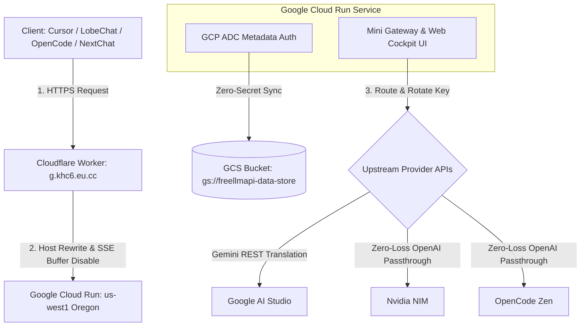

# FreeLLMAPI - High Performance Multi-Key LLM Gateway & Management Cockpit

A super lightweight, zero-dependency, and extremely fast Node.js API Gateway & Management Cockpit designed to run on **Google Cloud Run** and route through **Cloudflare Workers**. 

It aggregates and proxies LLM provider endpoints with automatic key rotation, intelligent failover retries, a single-page Web Cockpit for dynamic UI configuration, GCP GCS 5GB free-tier persistence, zero-loss transparent OpenAI passthrough, and 400/429/5xx error auditing.

---

## 🏗️ System Architecture

The gateway is architected for maximum speed, GFW bypass, pure egress IPs, and zero-secret data persistence:


```mermaid
graph TD
    Client[Client: Cursor / LobeChat / OpenCode / NextChat] 
    -->|1. HTTPS Request| CF[Cloudflare Worker: g.khc6.eu.cc]
    CF -->|2. Host Rewrite & SSE Buffer Disable| GCR[Google Cloud Run: us-west1 Oregon]
    
    subgraph Google Cloud Run Service
        Gateway[Mini Gateway & Web Cockpit UI]
        ADC[GCP ADC Metadata Auth]
    end

    ADC -->|Zero-Secret Sync| GCS[(GCS Bucket: gs://freellmapi-data-store)]

    Gateway -->|3. Route & Rotate Key| Upstream{Upstream Provider APIs}
    Upstream -->|Gemini REST Translation| Google[Google AI Studio]
    Upstream -->|Zero-Loss OpenAI Passthrough| Nvidia[Nvidia NIM]
    Upstream -->|Zero-Loss OpenAI Passthrough| OpenCode[OpenCode Zen]
```

### ⚡ Architectural Highlights
* **Web UI Cockpit (`GET /`)**: Built-in dark mode single-page management dashboard for viewing real-time metrics, dynamically managing providers and key pools, and auditing error logs.
* **GCP GCS Free-Tier Data Persistence**: Uses Google Application Default Credentials (ADC) via Metadata Server to store `config.json` and `error_logs.json` in `gs://freellmapi-data-store` (in `us-west1`), avoiding hardcoded secrets or database instances while staying 100% within GCP's 5GB/month free limit.
* **Zero-Loss Transparent Passthrough**: Standard OpenAI-compatible requests (OpenCode, Nvidia NIM, etc.) are forwarded as raw passthroughs preserving custom headers (`User-Agent`, `x-client-*`). Gemini native requests are automatically translated.
* **Cloudflare Stream Acceleration**: Streaming text responses (`text/event-stream`) set `Cache-Control: no-cache, no-transform` and `X-Accel-Buffering: no` to eliminate Cloudflare/Nginx buffer packing for zero-latency typewriter streaming.

---

## 🎛️ Features & Web Cockpit

Access the Web Cockpit by navigating to `https://g.khc6.eu.cc/` (or your Cloud Run URL) in any web browser and authenticating with your `ACCESS_TOKEN`:

1. **📊 Status Overview**:
   - Live uptime counter, total request volume, automatic key failover count, and caught error statistics.
   - Client endpoint setup instructions for Cursor, LobeChat, etc.

2. **⚙️ Provider & Key Pool Management**:
   - Dynamically create, edit, or delete provider configurations without restarting the server.
   - Configure Base URL, Proxy Type (`openai-passthrough` vs `gemini-native`), multi-key pool (auto-rotated on failure), and associated model lists.

3. **📝 Error Audit Logs (400 / 429 / 5xx)**:
   - Captures status code, target model, provider name, rotated key index, and truncated error details for all client errors (400), rate limit throttling (429), and upstream server failures (5xx).
   - Persisted asynchronously to GCS storage.

---

## ⚙️ Environment Variables Configuration

Configure environment variables in your Cloud Run Service settings (under **Variables & Secrets**):

| Variable Name | Description | Example / Format |
| :--- | :--- | :--- |
| `ACCESS_TOKEN` | Security bearer token required for Web Cockpit login and API clients. | `6ammYiLu4F7FuxElG8SSYlpUqYDiBHBuQE3svJOMyVUF1QN3` |
| `GOOGLE_KEYS` | Initial fallback comma-separated Google Gemini API keys. | `key1,key2` |
| `NVIDIA_KEYS` | Initial fallback comma-separated Nvidia NIM API keys. | `key1,key2,key3` |
| `OPENCODE_KEYS` | Initial fallback comma-separated OpenCode Zen API keys. | `key1,key2` |
| `GCS_BUCKET_NAME` | GCP Storage bucket name (defaults to `freellmapi-data-store`). | `freellmapi-data-store` |

*(Note: Initial environment variables are used on first boot to populate the default `config.json` if GCS storage is initially empty).*

---

## 🔀 Routing & Error Recovery Rules

1. **Routing Pipeline**:
   - **OpenAI Passthrough (`openai-passthrough`)**: Direct raw forward of OpenAI payload and headers. Supports model ID rewriting if configured.
   - **Google Gemini Native (`gemini-native`)**: Translates OpenAI `messages`, `tools`, and `reasoning_effort` into Gemini REST API structures (`contents`, `systemInstruction`, `thinkingConfig`).

2. **Smart Retries & Key Rotation**:
   - The gateway rotates key pointers for the target provider upon encountering retryable failures.
   - **Retryable Errors**: `5xx` server errors, network connection drops, socket hangups, timeouts, and `408` / `429` (rate limits).
   - **Audit Logged**: All `400`, `401`, `403`, `404`, `429`, and `5xx` errors trigger an audit log record saved to GCS.

---

## 🚀 Deployment Instructions

### 1. Prerequisite: Authenticate GCP CLI
```bash
gcloud auth login
gcloud config set project <YOUR_PROJECT_ID>
```

### 2. Create GCS Storage Bucket (One-time Setup)
Create a free-tier storage bucket in `us-west1` (Oregon):
```bash
gcloud storage buckets create gs://freellmapi-data-store --location=us-west1
```

### 3. Deploy Gateway to Cloud Run
Run in the project root to compile and deploy:
```bash
gcloud run deploy freellmapi \
  --source mini-gateway \
  --region us-west1 \
  --allow-unauthenticated \
  --quiet
```

---

## 🌐 Cloudflare Worker Proxy Configuration

Because `*.run.app` domains may face DNS/GFW limitations in China, proxy requests through a Cloudflare Worker with custom domain `g.khc6.eu.cc`:

```javascript
const TARGET_URL = "https://freellmapi-559850716466.us-west1.run.app";

function corsHeaders(origin) {
  return {
    "Access-Control-Allow-Origin": origin || "*",
    "Access-Control-Allow-Methods": "GET, POST, PUT, DELETE, OPTIONS, PATCH",
    "Access-Control-Allow-Headers": "Content-Type, Authorization, X-Requested-With, anthropic-version, x-api-key",
    "Access-Control-Max-Age": "86400",
    "Access-Control-Allow-Credentials": "true",
  };
}

export default {
  async fetch(request, env) {
    const origin = request.headers.get("Origin") || "*";
    if (request.method === "OPTIONS") {
      return new Response(null, { status: 204, headers: corsHeaders(origin) });
    }
    const url = new URL(request.url);
    const targetUrl = `${TARGET_URL}${url.pathname}${url.search}`;
    const forwardHeaders = new Headers(request.headers);
    forwardHeaders.delete("host");
    forwardHeaders.delete("cf-connecting-ip");
    forwardHeaders.delete("cf-ray");
    forwardHeaders.delete("cf-visitor");
    forwardHeaders.delete("x-forwarded-proto");

    try {
      const response = await fetch(targetUrl, {
        method: request.method,
        headers: forwardHeaders,
        body: ["GET", "HEAD"].includes(request.method) ? null : request.body,
        duplex: "half",
      });
      const responseHeaders = new Headers(response.headers);
      const cors = corsHeaders(origin);
      for (const [k, v] of Object.entries(cors)) {
        responseHeaders.set(k, v);
      }
      if (responseHeaders.get("content-type")?.includes("text/event-stream")) {
        responseHeaders.set("Cache-Control", "no-cache, no-transform");
        responseHeaders.set("X-Accel-Buffering", "no");
        responseHeaders.delete("content-encoding");
      }
      return new Response(response.body, {
        status: response.status,
        statusText: response.statusText,
        headers: responseHeaders,
      });
    } catch (err) {
      return new Response(JSON.stringify({ error: "upstream_unreachable", detail: err.message }), {
        status: 502,
        headers: { "Content-Type": "application/json", ...corsHeaders(origin) }
      });
    }
  }
};
```

---

## 🧪 Verification and Testing

### 1. Test Models List
```bash
curl -i https://g.khc6.eu.cc/v1/models
```

### 2. Test OpenCode Passthrough Completion
```bash
curl -i -H "Content-Type: application/json" \
  -H "Authorization: Bearer <YOUR_ACCESS_TOKEN>" \
  -d '{"model": "deepseek-v4-flash-free", "messages": [{"role": "user", "content": "Hello gateway!"}]}' \
  https://g.khc6.eu.cc/v1/chat/completions
```

### 3. Test Gemini Native Completion
```bash
curl -i -H "Content-Type: application/json" \
  -H "Authorization: Bearer <YOUR_ACCESS_TOKEN>" \
  -d '{"model": "gemini-3.1-flash-lite", "messages": [{"role": "user", "content": "Hello gateway!"}]}' \
  https://g.khc6.eu.cc/v1/chat/completions
```

### 4. Admin API Config & Logs Inspection
```bash
# Get current dynamic config
curl -i -H "Authorization: Bearer <YOUR_ACCESS_TOKEN>" https://g.khc6.eu.cc/api/config

# Get error audit logs and statistics
curl -i -H "Authorization: Bearer <YOUR_ACCESS_TOKEN>" https://g.khc6.eu.cc/api/logs
```
